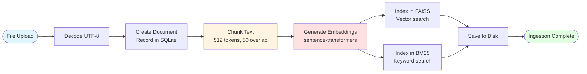

# RAG Microservice

A production-ready document Q&A microservice with hybrid retrieval and entropy-based validation.

> **Note**: Code comments and documentation were AI-generated and human-verified. The implementation, architecture, and core algorithms are human-designed.

## Features

- **Hybrid Retrieval**: Combines BM25 (keyword) + FAISS (semantic) search with RRF fusion
- **Smart Reranking**: BM25 re-scoring on FAISS candidates for best of both worlds
- **MMR Diversity**: Removes redundant chunks to return diverse information
- **Novel Entropy Validation**: Measures retrieval consistency across query variants for confidence scoring
- **LLM Answer Generation**: Uses Groq API (llama-3.3-70b-versatile) to synthesize answers from retrieved chunks
- **Hallucination Detection**: Verifies generated answers are grounded in source documents
- **FastAPI Backend**: Clean REST API with automatic OpenAPI docs
- **Docker Deployment**: Everything runs in containers with docker-compose

## Novel Algorithm: Entropy-Based Validation

Inspired by Anthropic's mechanistic interpretability research on circuit tracing in LLMs, this system implements an entropy-based validation mechanism that:

1. **Generates query variants** - Creates 3 reformulations of the user's question
2. **Measures retrieval consistency** - Tracks which chunks each variant retrieves
3. **Calculates entropy** - Low entropy (<0.3) indicates consistent retrieval = confident answer
4. **Validates semantic convergence** - Checks if consensus chunks are semantically similar

**Key Insight**: Just as robust neural circuits converge through multiple activation paths, robust RAG answers should converge when approached from multiple query reformulations.

**Impact**: Provides interpretable confidence scores and reduces false-positive retrievals by identifying when the system is uncertain.

## Architecture

### System Architecture


### Query Pipeline Flow


### Ingestion Pipeline Flow



## Tech Stack

- **FastAPI** - Web framework
- **SQLite** - Document and chunk storage
- **sentence-transformers** - Text embeddings (all-MiniLM-L6-v2)
- **FAISS** - Dense vector search
- **BM25** - Sparse keyword search
- **Groq API** - LLM inference (llama-3.3-70b-versatile)
- **Docker** - Containerization

## Quick Start

### Prerequisites

- Docker and docker-compose installed
- Groq API key (free tier available at https://console.groq.com)

### Setup Groq API Key

1. **Get your Groq API key**:
   - Visit https://console.groq.com
   - Sign up for a free account
   - Navigate to API Keys section
   - Create a new API key

2. **Configure the API key** (choose one method):

   **Method 1: Environment Variable (Recommended for Production)**
   ```bash
   # Create a .env file in the project root
   echo "GROQ_API_KEY=your_groq_api_key_here" > .env
   ```

   **Method 2: Docker Compose File**
   ```bash
   # Edit docker-compose.yml and update line 25:
   - GROQ_API_KEY=your_groq_api_key_here
   ```

   **Method 3: Config File**
   ```bash
   # Edit app/core/config.py around line 12:
   GROQ_API_KEY: str = "your_groq_api_key_here"
   ```

   > **⚠️ Security Warning**: Never commit API keys to version control! Add `.env` and `config.py` to `.gitignore` in production environments. Use environment variables or secrets management instead.

### Run the Service

```bash
# Clone the repository
cd rag-microservice

# Option 1: Using environment variable (recommended)
export GROQ_API_KEY=your_groq_api_key_here
docker-compose up --build

# Option 2: After editing docker-compose.yml or config.py
docker-compose up --build

# Service will be available at http://localhost:8000
# API docs at http://localhost:8000/docs
```

The first startup will download the sentence-transformers model (~90MB) and take a few minutes.

### Quick Setup Summary

```bash
# 1. Get Groq API key from https://console.groq.com
# 2. Set it as environment variable
export GROQ_API_KEY=gsk_your_actual_key_here

# 3. Start the service
docker-compose up --build

# 4. Test the health endpoint
curl http://localhost:8000/api/v1/health

# 5. Ingest a document
curl -X POST http://localhost:8000/api/v1/ingest \
  -F "file=@data/sample_docs/python_basics.md"

# 6. Query the system
curl -X POST http://localhost:8000/api/v1/query \
  -H "Content-Type: application/json" \
  -d '{"query": "What is a Python decorator?", "method": "hybrid", "use_rerank": true, "top_k": 3}'
```

## API Usage

### 1. Health Check

```bash
curl http://localhost:8000/api/v1/health
```

Response:
```json
{
  "status": "healthy",
  "faiss_index_size": 0,
  "document_count": 0,
  "chunk_count": 0,
  "llm_status": "healthy"
}
```

### 2. Ingest a Document

```bash
curl -X POST http://localhost:8000/api/v1/ingest \
  -F "file=@/media/ibz/Stuff The First1/Projects/Simple RAG/data/sample_docs/python_basics.md"
```

Response:
```json
{
  "doc_id": 1,
  "filename": "python_basics.md",
  "doc_type": "markdown",
  "chunks_created": 12,
  "faiss_total": 12
}
```

### 3. Query (Full Pipeline)

```bash
curl -X POST http://localhost:8000/api/v1/query \
  -H "Content-Type: application/json" \
  -d '{
    "query": "What is a Python decorator?",
    "method": "hybrid",
    "use_rerank": true,
    "top_k": 3
  }'
```

Response:
```json
{
  "synthesized_answer": "A decorator in Python is a function that modifies the behavior...",
  "source_chunks": [
    {
      "chunk_id": 5,
      "text": "Decorators are a powerful feature in Python...",
      "score": 0.94,
      "doc_name": "python_basics.md",
      "doc_type": "markdown",
      "chunk_idx": 2
    }
  ],
  "query_variants": [
    "What is a Python decorator?",
    "Explain Python decorators",
    "How do decorators work in Python?"
  ],
  "validation": {
    "entropy_analysis": {
      "is_confident": true,
      "confidence_score": 0.87,
      "retrieval_entropy": 0.23,
      "semantic_consistency": 0.91,
      "interpretation": "HIGH CONFIDENCE: Query variants converge strongly..."
    },
    "grounding_check": {
      "is_grounded": true,
      "overlap_ratio": 0.89,
      "confidence": "high"
    },
    "overall_confidence": 0.88
  },
  "retrieval_stats": {
    "method": "hybrid_rerank",
    "total_retrieved": 18,
    "after_dedup": 12,
    "after_rerank": 12,
    "after_mmr": 3
  }
}
```

### 4. List Documents

```bash
curl http://localhost:8000/api/v1/documents?page=1&size=10
```

### 5. Get Metrics

```bash
curl http://localhost:8000/api/v1/metrics
```

## Example Walkthrough: Testing Entropy Validation

The entropy validator is a novel feature that measures retrieval consistency across query variants. Here's how to test it:

### Step 1: Ingest Machine Learning Document

```bash
curl -X POST http://localhost:8000/api/v1/ingest \
  -F "file=@/media/ibz/Stuff The First1/Projects/Simple RAG/data/sample_docs/machine_learning.md"
```

### Step 2: Run Test Queries

**High Confidence Query** (specific question → low entropy):
```bash
curl -X POST http://localhost:8000/api/v1/query \
  -H "Content-Type: application/json" \
  -d '{"query": "What is backpropagation in neural networks?", "method": "hybrid", "use_rerank": true, "top_k": 3}'
```

Expected: `retrieval_entropy` < 0.3, `is_confident: true`

**Low Confidence Query** (ambiguous question → high entropy):
```bash
curl -X POST http://localhost:8000/api/v1/query \
  -H "Content-Type: application/json" \
  -d '{"query": "How does it work?", "method": "hybrid", "use_rerank": true, "top_k": 3}'
```

Expected: `retrieval_entropy` > 0.7, `is_confident: false`

**Dense Semantic Search**:
```bash
curl -X POST http://localhost:8000/api/v1/query \
  -H "Content-Type: application/json" \
  -d '{"query": "Explain gradient descent", "method": "dense", "use_rerank": false, "top_k": 2}'
```

### Understanding Entropy Validation Results

Check the `validation.entropy_analysis` section in the response:

```json
{
  "validation": {
    "entropy_analysis": {
      "is_confident": true,
      "confidence_score": 0.87,
      "retrieval_entropy": 0.23,
      "semantic_consistency": 0.91,
      "interpretation": "HIGH CONFIDENCE: Query variants converge strongly..."
    },
    "grounding_check": {
      "is_grounded": true,
      "overlap_ratio": 0.96,
      "confidence": "high"
    },
    "overall_confidence": 0.88
  }
}
```

**Key Metrics:**
- **retrieval_entropy**: Lower = more consistent retrieval (0.0-1.0)
- **semantic_consistency**: Higher = chunks are more similar (0.0-1.0)
- **is_confident**: Boolean based on entropy < 0.3 threshold
- **grounding_check**: Verifies answer is based on retrieved chunks

## API Endpoints

| Method | Endpoint | Description |
|--------|----------|-------------|
| GET | `/` | Service info |
| GET | `/docs` | Interactive API docs (Swagger) |
| POST | `/api/v1/ingest` | Upload and index a document |
| POST | `/api/v1/query` | Query the RAG system |
| GET | `/api/v1/documents` | List all indexed documents |
| GET | `/api/v1/health` | Health check |
| GET | `/api/v1/metrics` | System metrics |

## Configuration

### Configuration Files

**1. docker-compose.yml**

The docker-compose file contains all environment variables for the containerized app:

```yaml
services:
  fastapi-app:
    environment:
      # LLM Configuration - UPDATE THIS WITH YOUR API KEY
      - GROQ_API_KEY=your_groq_api_key_here  # Get from https://console.groq.com
      - LLM_MODEL=llama-3.3-70b-versatile

      # Embedding Model (runs locally, no API key needed)
      - EMBEDDING_MODEL=sentence-transformers/all-MiniLM-L6-v2

      # Database and Indices
      - DATABASE_URL=sqlite:////app/data/persistent/rag.db
      - FAISS_INDEX_PATH=/app/data/persistent/faiss.index
      - BM25_INDEX_PATH=/app/data/persistent/bm25.pkl

      # Chunking
      - CHUNK_SIZE=512
      - CHUNK_OVERLAP=50

      # Retrieval
      - TOP_K_DEFAULT=5
      - RRF_K=60
      - MMR_LAMBDA=0.7

      # Validation
      - ENTROPY_THRESHOLD=0.3
      - GROUNDING_THRESHOLD=0.7

      # LLM Generation
      - LLM_TEMPERATURE=0.1
      - LLM_MAX_TOKENS=500
```

**2. app/core/config.py**

The config.py file defines default values. Update the GROQ_API_KEY if not using docker-compose:

```python
class Settings(BaseSettings):
    # Groq configuration (for LLM only)
    GROQ_API_KEY: str = "your_groq_api_key_here"  # UPDATE THIS
    LLM_MODEL: str = "llama-3.3-70b-versatile"

    # Embedding model (sentence-transformers, runs locally)
    EMBEDDING_MODEL: str = "sentence-transformers/all-MiniLM-L6-v2"

    # Database
    DATABASE_URL: str = "sqlite:////app/data/persistent/rag.db"

    # ... other settings
```

**Note**: Environment variables in docker-compose.yml override values in config.py.

### Available Models on Groq

- `llama-3.3-70b-versatile` (default, recommended)
- `llama-3.1-70b-versatile`
- `mixtral-8x7b-32768`
- `gemma2-9b-it`

Update `LLM_MODEL` in docker-compose.yml or config.py to use a different model.

## Testing

```bash
# Run tests inside Docker container
docker-compose exec fastapi-app pytest tests/ -v

# Or locally (requires dependencies and Groq API key)
pytest tests/ -v
```

## Project Structure

```
rag-microservice/
├── app/
│   ├── main.py                 # FastAPI app
│   ├── core/
│   │   ├── config.py           # Configuration
│   │   └── database.py         # SQLite setup
│   ├── models/
│   │   ├── document.py         # Database models
│   │   └── schemas.py          # Pydantic schemas
│   ├── services/
│   │   ├── embedder.py         # Sentence-transformers wrapper
│   │   ├── ingest_service.py   # Document ingestion
│   │   ├── retrieval_service.py # Hybrid retrieval
│   │   ├── query_agent.py      # Full RAG pipeline
│   │   └── validator.py        # Entropy validation
│   ├── api/
│   │   └── routes.py           # All API endpoints in one file
│   └── utils/
│       ├── chunking.py         # Text chunking
│       ├── rrf.py              # Reciprocal Rank Fusion
│       ├── mmr.py              # MMR diversity
│       └── hallucination.py    # Grounding check
├── tests/
│   ├── test_ingest.py
│   ├── test_retrieval.py
│   └── test_query.py
├── data/
│   ├── sample_docs/            # 5 sample markdown files
│   └── persistent/             # SQLite, FAISS, BM25 (created by Docker)
├── Dockerfile
├── docker-compose.yml
├── requirements.txt
└── README.md
```

## How It Works

### 1. Ingestion Pipeline

```
File Upload → UTF-8 Decode → Chunk (512 tokens, 50 overlap)
  → Generate Embeddings → Index in FAISS → Index in BM25 → Save to SQLite
```

### 2. Query Pipeline

```
Query → Expand (3 variants)
  → Multi-Query Retrieval (BM25 + FAISS)
  → RRF Fusion → BM25 Reranking → Deduplication
  → MMR Diversity → Entropy Validation
  → LLM Synthesis → Hallucination Check → Response
```

### 3. Retrieval Methods

- **Sparse (BM25)**: Keyword matching, good for exact terms
- **Dense (FAISS)**: Semantic similarity, good for concepts
- **Hybrid**: RRF fusion of both, best overall performance

### 4. BM25 Reranking Strategy

Instead of cross-encoder (which requires additional models):
1. Get top-20 from FAISS (semantic)
2. Re-score those 20 using BM25 (keyword)
3. Combine scores for final ranking

**Benefit**: Catches both semantic matches AND exact keyword matches in final candidates

## Development

### Run Without Docker

```bash
# Install dependencies
pip install -r requirements.txt

# Set environment variables
cp .env.example .env
# Update .env with your Groq API key

# Run the app
uvicorn app.main:app --reload

# Run tests
pytest tests/ -v
```

### Adding New Documents

Place text or markdown files in `data/sample_docs/` and ingest via API, or mount a different directory in docker-compose.yml.

## Performance

- **Embedding Generation**: ~100ms per chunk (sentence-transformers)
- **FAISS Search**: <10ms for 1000s of chunks
- **BM25 Search**: <5ms for 1000s of chunks
- **LLM Generation**: 1-3 seconds (Groq API with llama-3.1-70b)
- **Total Query Time**: ~2-4 seconds (including LLM)

## Troubleshooting

### Groq API Issues

**Problem**: "Error generating answer" or "API key invalid"
- **Solution**: Verify your Groq API key is correct
- Check the key at https://console.groq.com/keys
- Ensure the key is properly set in docker-compose.yml or environment variable

**Problem**: "Rate limit exceeded"
- **Solution**: Groq free tier has rate limits
- Wait a few minutes between requests
- Consider upgrading to a paid plan for higher limits

**Problem**: "llm_status: unhealthy" in health check
- **Solution**: Check if the Groq API is accessible
- Test your API key: `curl -H "Authorization: Bearer $GROQ_API_KEY" https://api.groq.com/openai/v1/models`
- Verify docker container has internet access

### General Issues

**Problem**: Container fails to start
- Check logs: `docker logs rag-microservice`
- Ensure port 8000 is not already in use
- Verify Docker has sufficient memory (at least 2GB)

**Problem**: Slow first query
- The first query triggers model download (~90MB)
- Subsequent queries will be faster
- Models are cached in the container

## Limitations

- SQLite is suitable for <100K documents; use PostgreSQL for larger scale
- FAISS IndexFlatL2 is exact but slow for >1M vectors; use IndexIVFFlat for scale
- BM25 index is rebuilt on each ingest; optimize for production
- LLM generation requires Groq API key and internet connection

## Future Enhancements (Added this for myself)

- [ ] Support for PDF and DOCX files
- [ ] Persistent query metrics tracking
- [ ] Multiple LLM backend support
- [ ] Advanced reranking with cross-encoder models
- [ ] Streaming LLM responses
- [ ] Vector database integration (Pinecone, Weaviate)
- [ ] Authentication and rate limiting

